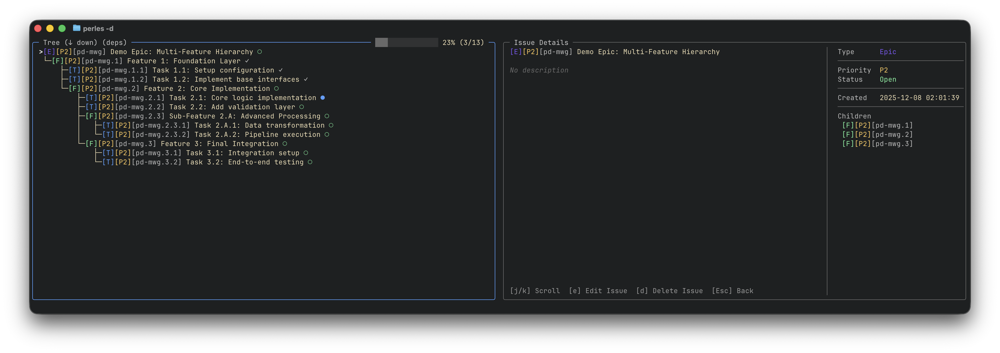
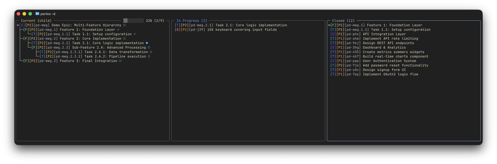
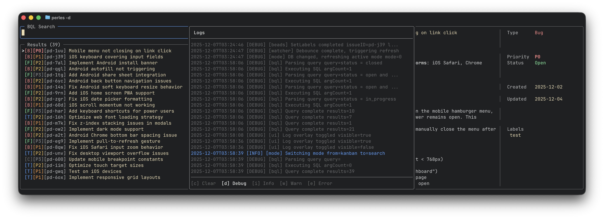

# Perles

Perles is a terminal UI for [beads](https://github.com/gastownhall/beads) issue tracking, powered by a custom **BQL (Beads Query Language)**. Search with boolean logic, filter by dates, traverse dependency trees, and build custom kanban views without leaving your terminal. Each kanban swimlane column is defined by a BQL query, so you can slice your issues however you want.

Perles has its own [Orchestration Control Plane](ORCHESTRATION.md) that spawns a headless coordinator agent that can manage and recycle multiple headless worker agents for you with built-in multi-agent workflows or user defined workflows that can run in parallel.

<p align="center">
  
</p>
<p align="center">
  
</p>
<p align="center">
  
</p>
<p align="center">
  
</p>
<p align="center">
  
</p>
<p align="center">
  
</p>

## Requirements

- beads CLI/runtime `v1.0.0+` (upstream: `gastownhall/beads`)
- A beads project configured for `backend=dolt` and `dolt_mode=server`
- A v1-compatible project layout (`.beads/metadata.json`, `.beads/dolt/config.yaml`, `.beads/dolt-server.port`)

For full compatibility boundaries and migration/repair guidance, see [docs/BEADS-COMPATIBILITY.md](docs/BEADS-COMPATIBILITY.md).

### beads install sources

Install beads from current upstream sources:

- Repository: `https://github.com/gastownhall/beads`
- Releases: `https://github.com/gastownhall/beads/releases`
- Go install: `go install github.com/gastownhall/beads/cmd/bd@latest`

For reproducible local validation in this repo, `mise.toml` pins beads `1.0.0`:

```bash
mise x github:gastownhall/beads@1.0.0 -- bd version
```

### beads support policy (short version)

- ✅ Supported: beads `v1.0.0+`, `backend=dolt`, `dolt_mode=server`
- ❌ Not supported yet: `dolt_mode=embedded`, `dolt_mode=shared-server`, non-Dolt backends
- ⚠️ Upgrade note for existing users: BQL `ready=true` and `blocked=true` semantics now follow beads v1 behavior; custom board queries using these pseudo-fields may route issues differently after upgrade.

If Perles reports compatibility/runtime errors, run:

```bash
bd bootstrap
```

Then verify mode/runtime metadata and retry Perles.

## Installation

### Install Script

```bash
curl -sSL https://raw.githubusercontent.com/hk9890/perles/main/install.sh | bash
```

### Homebrew (status)

Homebrew publishing is intentionally not part of the first fork release. For `v0.1.0`, use the install script or GitHub release binaries.

### Go Install

Requires Go 1.21+

```bash
go install github.com/hk9890/perles@latest
```

### Build from Source

```bash
git clone https://github.com/hk9890/perles.git
cd perles
make install
perles
```

### Binary Downloads

Pre-built binaries for Linux and macOS (both Intel and Apple Silicon) are available on the [Releases](https://github.com/hk9890/perles/releases) page.

1. Download the archive for your platform
2. Extract: `tar -xzf perles_*.tar.gz`
3. Move to PATH: `sudo mv perles /usr/local/bin/`
4. Verify: `perles --version`

## Usage

Run `perles` in any directory containing a `.beads/` folder:

```bash
cd your-project
perles
```

### CLI Flags

| Flag | Short | Description |
|------|-------|-------------|
| `--beads-dir` | `-b` | Path to beads database directory |
| `--config` | `-c` | Path to config file |
| `--no-auto-refresh` | | Disable automatic board refresh |
| `--version` | `-v` | Print version |
| `--help` | `-h` | Print help |
| `--debug` | `-d` | Enable developer/debug mode (runtime log level DEBUG) |

### CLI Commands

| Command | Description |
|---------|-------------|
| `perles` | Launch the TUI application |
| `perles themes` | List available theme presets |
| `perles workflows` | List available workflow templates |

### Global Keybindings

| Key          | Action |
|--------------|--------|
| `ctrl+space` | Switch between Kanban and Search modes |
| `?`          | Toggle help overlay |
| `ctrl+c`     | Quit |

---

## Kanban Mode

Organize issues into customizable columns powered by BQL queries or dependency trees.

### BQL Columns

<p align="center">
  
</p>

### Mixed Column Types (BQL + Dependency Trees)

<p align="center">
  
</p>

### Features

- Built-in `Default` workflow board (v1-aware): Not Ready, Ready, In Progress, Done
- Built-in `Deferred` board for frozen/deferred work (`status_category = frozen`)
- Fully customizable columns with BQL queries or dependency trees
- Multi-view support — create unlimited board views
- Real-time auto-refresh when database changes
- Column management: add, edit, reorder, delete

### Videos

#### Navigating Views and Columns

Use `h` and `l` to move left and right between columns, `ctrl+h` / `ctrl+l` to move column positions and `ctrl+n` / `ctrl+p` to switch between views. Use `ctrl+v` to open the view menu to create, rename or delete a view.

https://github.com/user-attachments/assets/174dc673-66fa-46be-9ca5-fbd5ac0034dd

#### Adding a New Column

Use `a` from kanban mode to add a new column.

https://github.com/user-attachments/assets/8ce16144-15dd-4509-8cd9-aa8e07477b5d

### Keybindings

#### Navigation

| Key | Action |
|-----|--------|
| `h` / `←` | Move to left column |
| `l` / `→` | Move to right column |
| `j` / `↓` | Move down in column |
| `k` / `↑` | Move up in column |
| `Enter` | View issue details |

#### Views

| Key | Action |
|-----|--------|
| `ctrl+j` / `ctrl+n` | Next view |
| `ctrl+k` / `ctrl+p` | Previous view |
| `ctrl+v` | View menu (Create/Delete/Rename) |
| `w`      | Toggle status bar          |

#### Columns

| Key | Action |
|-----|--------|
| `a` | Add new column |
| `e` | Edit current column |
| `d` | Delete current column |
| `ctrl+h` | Move column left |
| `ctrl+l` | Move column right |
| `/` | Open search with column's BQL query |

#### Issues

| Key      | Action                     |
|----------|----------------------------|
| `y`      | Copy issue ID to clipboard |
| `r`      | Refresh issues             |
| `ctrl+e` | Edit issue                 |
| `ctrl+d` | Delete issue               |

### Built-in Views

Perles ships with these built-in views (all configurable):

#### `Default` workflow view

| Column | BQL Query |
|--------|-----------|
| **Not Ready** | `status = blocked or status_category = frozen or (status = open and (not ready = true or label in (needs:discussion, has:open-questions)))` |
| **Ready** | `ready = true and label not in (needs:discussion, has:open-questions)` |
| **In Progress** | `(status in (in_progress, hooked) or status_category = wip) and status != blocked` |
| **Done** | `status = closed or status_category = done` |

`Not Ready` is intentionally scoped to open issues (plus explicit `status = blocked`) so closed/deferred work does not leak into the actionable workflow lane.

#### `Deferred` view

| Column | BQL Query |
|--------|-----------|
| **Deferred** | `status_category = frozen` |

---

## Search Mode

Full-screen BQL-powered search interface with live results and issue details.

<p align="center">
  
</p>

### Features

- Full-screen BQL-powered search interface
- Save searches as kanban columns
- Create new views from search results
- Sub-mode for viewing issue dependencies and hierarchies

### Videos

#### BQL Search

Use `ctrl+space` to switch modes between Kanban and Search or while on a column use `/` to be dropped into search mode with the current columns BQL query.

https://github.com/user-attachments/assets/d0d61c71-a037-4f7b-9718-15156d6bf278

#### Creating a View from Search Results

Use `ctrl+s` from search mode to save the BQL query to a new or existing view.

https://github.com/user-attachments/assets/21085552-a62f-441e-bba7-0960c00f5029

### Keybindings

| Key | Action |
|-----|--------|
| `/` | Focus search input |
| `Enter` | Execute query / Edit field |
| `h` | Move to results list |
| `l` | Move to details panel |
| `j` / `k` | Navigate results |
| `y` | Copy issue ID |
| `s` | Change status |
| `p` | Change priority |
| `ctrl+s` | Save search as column |
| `Esc` | Exit to kanban mode |

---

## Dependency Explorer

Visualize and navigate issue relationships — blockers, dependencies, and parent/child hierarchies.

### Dependency Chain

<p align="center">
  
</p>

### Parent/Child Hierarchy

<p align="center">
  
</p>

### Keybindings (Tree View)

| Key | Action |
|-----|--------|
| `j` / `k` | Move cursor up/down |
| `l` / `Tab` | Focus details panel |
| `h` | Focus tree panel |
| `Enter` | Refocus tree on selected node |
| `u` | Go back to previous root |
| `U` | Go to original root |
| `d` | Toggle direction (up/down) |
| `m` | Toggle mode (deps/children) |
| `y` | Copy issue ID |
| `/` | Switch to list mode |
| `Esc` | Exit to kanban mode |

---

## BQL Query Language

Perles uses BQL (Beads Query Language) to filter and organize issues. BQL is used in column definitions and search mode.

### Basic Syntax

```
field operator value [and|or field operator value ...]
```

### Available Fields

| Field | Description | Example Values |
|-------|-------------|----------------|
| `status` | Issue status | open, in_progress, blocked, hooked, pinned, deferred, closed (+ custom) |
| `status_category` | Status category | active, wip, done, frozen |
| `type` | Issue type | bug, feature, task, epic, chore, decision, spike, story, milestone (+ custom) |
| `priority` | Priority level | P0, P1, P2, P3, P4 |
| `blocked` | Has blockers | true, false |
| `ready` | Ready to work | true, false |
| `pinned` | Is pinned | true, false |
| `is_template` | Is a template | true, false |
| `label` | Issue labels | any label string |
| `title` | Issue title | any text (use ~ for contains) |
| `description` | Issue description | any text (use ~ for contains) |
| `design` | Design notes | any text (use ~ for contains) |
| `notes` | Issue notes | any text (use ~ for contains) |
| `id` | Issue ID | e.g., bd-123 |
| `assignee` | Assigned user | username |
| `sender` | Issue sender | username |
| `created_by` | Issue creator | username |
| `hook_bead` | Agent's current work | bead ID |
| `role_bead` | Agent's role definition | bead ID |
| `agent_state` | Agent state | idle, running, stuck, stopped |
| `role_type` | Agent role type | polecat, crew, witness, etc. |
| `rig` | Agent's rig name | rig name (empty for town-level) |
| `mol_type` | Molecule type | string |
| `created` | Creation date | today, yesterday, -7d, -3m |
| `updated` | Last update | today, -24h |
| `last_activity` | Agent last activity | today, -24h |

### Operators

| Operator | Description | Example |
|----------|-------------|---------|
| `=` | Equals | `status = open` |
| `!=` | Not equals | `type != chore` |
| `<` | Less than | `priority < P2` |
| `>` | Greater than | `priority > P3` |
| `<=` | Less or equal | `priority <= P1` |
| `>=` | Greater or equal | `created >= -7d` |
| `~` | Contains | `title ~ auth` |
| `!~` | Not contains | `title !~ test` |
| `in` | In list | `status in (open, in_progress)` |
| `not in` | Not in list | `label not in (backlog)` |

### Boolean Logic

```bql
# AND - both conditions must match
status = open and priority = P0

# OR - either condition matches
type = bug or type = feature

# NOT - negate a condition
not blocked = true

# Parentheses for grouping
(type = bug or type = feature) and priority <= P1
```

### Date Filters

```bql
# Relative dates
created >= -7d          # Last 7 days
updated >= -24h         # Last 24 hours
created >= -3m          # Last 3 months

# Named dates
created >= today
created >= yesterday
```

### Sorting

```bql
# Single field
status = open order by priority

# Multiple fields with direction
type = bug order by priority asc, created desc
```

### Expand (Include Related Issues)

The `expand` keyword includes related issues in your search results, allowing you to see complete issue hierarchies and dependency chains.

```bql
# Basic syntax
<filter> expand <direction> [depth <n>]
```

#### Expansion Directions

| Direction | Description |
|-----------|-------------|
| `up` | Issues you depend on (parents + blockers) |
| `down` | Issues that depend on you (children + blocked issues) |
| `all` | Both directions combined |

#### Depth Control

| Depth | Description |
|-------|-------------|
| `depth 1` | Direct relationships only (default) |
| `depth 2-10` | Include relationships up to N levels deep |
| `depth *` | Unlimited depth (follows all relationships) |

#### Examples

```bql
# Get an epic and all its children
type = epic expand down

# Get an epic and all descendants (unlimited depth)
type = epic expand down depth *

# Get an issue and everything blocking it
id = bd-123 expand up

# Get an issue and all related issues (both directions)
id = bd-123 expand all depth *

# Get all epics with their full hierarchies
type = epic expand all depth *
```

### Example Queries

```bql
# Critical bugs
type = bug and priority = P0

# Ready work, excluding backlog
status = open and ready = true and label not in (backlog)

# In-progress lane matching built-in board behavior
(status in (in_progress, hooked) or status_category = wip) and status != blocked

# Recently updated high-priority items
priority <= P1 and updated >= -24h order by updated desc

# Search by title
title ~ authentication or title ~ login

# Epic with all its children
type = epic expand down depth *
```

---

## Configuration

Perles looks for configuration in these locations (in order):
1. `--config` flag
2. `.perles/config.yaml` (current directory)
3. `~/.config/perles/config.yaml`

### Configuration Options

| Option                                           | Type | Default              | Description                                                   |
|--------------------------------------------------|------|----------------------|---------------------------------------------------------------|
| `beads_dir`                                      | string | `""`                 | Path to beads database directory (default: current directory) |
| `auto_refresh`                                   | bool | `true`               | Auto-refresh when database changes                            |
| `ui.show_counts`                                 | bool | `true`               | Show issue counts in column headers                           |
| `ui.show_status_bar`                             | bool | `true`               | Show status bar at bottom                                     |
| `ui.vim_mode`                                    | bool | `false`              | Vim support for all textarea inputs |
| `theme.preset`                                   | string | `""`                 | Theme preset name (see Theming section)                       |
| `theme.colors.*`                                 | hex | varies               | Individual color token overrides                              |
| `orchestration.coordinator_client`               | string | `"claude"`           | AI client: claude, amp, codex or opencode                     |
| `orchestration.worker_client`                    | string | `"claude"`           | AI client: claude, amp, codex or opencode                     |
| `orchestration.session_storage.application_name` | string | auto                 | Override application name (default: derived from git remote)  |
| `orchestration.templates.document_path`          | string | `"docs/proposals"`   | Base path for generated workflow documents                    |

### Example Configuration

```yaml
# Path to beads database directory (default: current directory)
# beads_dir: /path/to/project

# Auto-refresh when database changes
auto_refresh: true

# UI settings
ui:
  show_counts: true
  show_status_bar: true
  vim_mode: false

# Theme (use a preset or customize colors)
theme:
  # preset: catppuccin-mocha  # Uncomment to use a theme preset
  # colors:                    # Override specific colors
  #   text.primary: "#FFFFFF"
  #   status.error: "#FF0000"

# Board views
views:
  - name: Default
    columns:
      - name: Not Ready
        type: bql
        query: "status = blocked or status_category = frozen or (status = open and (not ready = true or label in (needs:discussion, has:open-questions)))"
        color: "#FF8787"
      - name: Ready
        type: bql
        query: "ready = true and label not in (needs:discussion, has:open-questions)"
        color: "#73F59F"
      - name: In Progress
        type: bql
        query: "(status in (in_progress, hooked) or status_category = wip) and status != blocked"
        color: "#54A0FF"
      - name: Done
        type: bql
        query: "status = closed or status_category = done"
        color: "#BBBBBB"

  - name: Deferred
    columns:
      - name: Deferred
        type: bql
        query: "status_category = frozen"

  - name: Bugs Only
    columns:
      - name: Open Bugs
        type: bql
        query: "type = bug and status = open"
        color: "#EF4444"
      - name: In Progress
        type: bql
        query: "type = bug and status = in_progress"
        color: "#F59E0B"
      - name: Fixed
        type: bql
        query: "type = bug and status = closed"
        color: "#10B981"

  - name: Work
    columns:
      - name: Current
        type: tree
        issue_id: bd-123
        tree_mode: child
        color: "#EF4444"

# AI Orchestration settings
orchestration:
  coordinator_client: claude           # claude (default), amp, codex or opencode
  worker_client: claude                # claude (default), amp, or codex or opencode
  session_storage:
    # application_name: my-project     # Optional: override auto-derived name
  templates:
    document_path: docs/proposals      # Base path for generated workflow documents
```

---

## Theming

Perles supports comprehensive theming with built-in presets and customizable color tokens.

### Quick Start with Presets

Use a built-in theme preset by adding to your config:

```yaml
theme:
  preset: catppuccin-mocha
```

### Available Presets

Run `perles themes` to see all available presets:

| Preset | Description |
|--------|-------------|
| `default` | Default perles theme |
| `catppuccin-mocha` | Warm, cozy dark theme |
| `catppuccin-latte` | Warm, cozy light theme |
| `dracula` | Dark theme with vibrant colors |
| `nord` | Arctic, north-bluish palette |
| `high-contrast` | High contrast for accessibility |

### Customizing Colors

Override specific colors while using a preset:

```yaml
theme:
  preset: dracula
  colors:
    status.error: "#FF0000"
    priority.critical: "#FF5555"
```

Or create a fully custom theme:

```yaml
theme:
  colors:
    text.primary: "#FFFFFF"
    text.muted: "#888888"
    status.success: "#00FF00"
    status.error: "#FF0000"
    border.default: "#444444"
    border.focus: "#FFFFFF"
```

### Color Tokens

Colors are organized by category:

| Category           | Tokens |
|--------------------|--------|
| **Text**           | `text.primary`, `text.secondary`, `text.muted`, `text.description`, `text.placeholder` |
| **Border**         | `border.default`, `border.focus`, `border.highlight` |
| **Status**         | `status.success`, `status.warning`, `status.error` |
| **Buttons**        | `button.text`, `button.primary.bg`, `button.primary.focus`, `button.danger.bg` |
| **Selection**      | `selection.indicator`, `selection.background`|
| **Toasts**         | `toast.success`, `toast.error`, `toast.info`, `toast.warn` |
| **Issue Priority** | `priority.critical`, `priority.high`, `priority.medium`, `priority.low`, `priority.backlog` |
| **Issue Status**   | `issue.status.open`, `issue.status.in_progress`, `issue.status.closed` |
| **Issue Type**     | `type.task`, `type.bug`, `type.feature`, `type.epic`, `type.chore` |
| **BQL Syntax**     | `bql.keyword`, `bql.operator`, `bql.field`, `bql.string`, `bql.literal` |

See `internal/ui/styles/tokens.go` for the complete list of color tokens.

---

## Runtime Logging and Developer Mode

Perles always writes runtime logs. Normal runs log at `ERROR` level, while developer/debug mode raises runtime logging to `DEBUG` and enables extra troubleshooting signal.

### Enabling Debug Mode

```bash
# Via flag
perles --debug

# Via environment variable
PERLES_DEBUG=1 perles

# With custom log path
PERLES_LOG=/tmp/perles.log perles
PERLES_LOG=/tmp/perles.log perles --debug
```

### Features

- **Runtime log file**: By default, log output is written to `$XDG_STATE_HOME/perles/logs/<basename>-<short-hash>/YYYY-MM-DD-perles.log` (fallback: `~/.local/state/perles/logs/<basename>-<short-hash>/YYYY-MM-DD-perles.log`). Normal runs record `ERROR` entries; debug runs record `DEBUG` and above. Set `PERLES_LOG` to use a custom path instead.
- **Log overlay**: Press `ctrl+x` to view logs in-app without leaving the TUI
- **Lifecycle logging**: Application startup and shutdown events are logged

<p align="center">
  
</p>

### Reporting Issues

When reporting bugs, please include the relevant Perles log file to help with diagnosis:

1. Run `perles` (or `perles --debug` if lower-severity diagnostics are needed)
2. Reproduce the issue
3. Attach the log file from `$XDG_STATE_HOME/perles/logs/<basename>-<short-hash>/` (or your `PERLES_LOG` override path) to your bug report

---

## Development

### Testing

Run tests:

```bash
make test        # Run all tests
make test-v      # Run with verbose output
```

### Golden Tests

Some tests use [teatest](https://github.com/charmbracelet/x/tree/main/exp/teatest) for snapshot testing of TUI output. These tests compare rendered output against golden files stored in `testdata/` directories.

When you intentionally change UI output, update the golden files:

```bash
make test-update
```

This regenerates golden files in packages with teatest tests (currently `internal/ui/help`). Review the changes before committing to ensure they're expected.

---

## License

MIT
