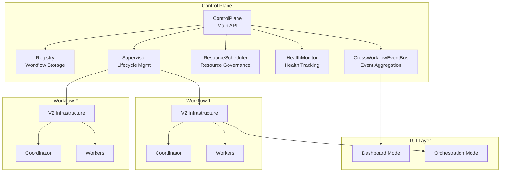

# Control Plane

The Control Plane enables running multiple concurrent AI orchestration workflows within Perles. It provides centralized resource management, health monitoring, and a dedicated Dashboard TUI for monitoring all active workflows.

## Overview

While [Orchestration Mode](../ORCHESTRATION.md) manages a single workflow session, the Control Plane introduces:

- **Multi-Workflow Support**: Run multiple concurrent workflows on different epics/tasks
- **Resource Governance**: Central limits on workflows, workers, AI calls, and tokens
- **Health Monitoring**: Automatic detection of stuck workflows with recovery options
- **Dashboard TUI**: Bird's-eye view of all workflows with quick actions
- **Event Aggregation**: Unified event stream from all workflows

---

## Architecture



### Core Components

| Component | Purpose |
|-----------|---------|
| **ControlPlane** | Main entry point for workflow lifecycle management |
| **Registry** | In-memory storage and querying of workflow instances |
| **Supervisor** | Creates/starts/stops workflows with their V2 infrastructure |
| **ResourceScheduler** | Enforces resource limits and manages leases |
| **HealthMonitor** | Tracks workflow health, detects stuck workflows |
| **CrossWorkflowEventBus** | Aggregates events from all workflows for unified subscription |

---

## Dashboard Mode

The Dashboard provides a multi-workflow management interface accessible from the main application.

### Keyboard Shortcuts

| Key | Action |
|-----|--------|
| `j` / `↓` | Move down one workflow |
| `k` / `↑` | Move up one workflow |
| `g` | Go to first workflow |
| `G` | Go to last workflow |
| `/` | Activate filter/search |
| `esc` | Clear filter |
| `s` | Start selected workflow |
| `p` | Pause selected workflow |
| `x` | Stop selected workflow |
| `n` | Create new workflow |
| `N` | Create new workflow and start immediately |
| `enter` | Open detail view |
| `?` | Toggle help |
| `q` | Quit |

### Workflow States

| State | Description |
|-------|-------------|
| `Pending` | Created but not yet started |
| `Running` | Actively executing |
| `Paused` | Temporarily suspended |
| `Completed` | Successfully finished |
| `Failed` | Terminated due to error |
| `Stopped` | Manually stopped by user |

### State Transitions

```
Pending   ─────────────────────────┬─────────────────────────▶ Stopped
    │                              │
    ▼                              │
Running  ──────────┬───────────────┼──────────────────────────▶ Stopped
    │              │               │
    │              ▼               │
    │          Paused ─────────────┼──────────────────────────▶ Stopped
    │              │               │
    │              │               │
    ▼              ▼               │
Completed      Failed              │
```

---

## Configuration

Configure the Control Plane in `~/.config/perles/config.yaml`:

```yaml
orchestration:
  control_plane:
    resource_policy:
      max_workflows_running: 5      # Max concurrent workflows (default: 5)
      max_workers: 10               # Max workers across all workflows (default: 10)
      max_ai_calls: 5               # Max concurrent AI API calls (default: 5)
      token_budget: 0               # Total token budget, 0 = unlimited (default: 0)
      port_range_start: 9000        # MCP server port range start (default: 9000)
      port_range_end: 9100          # MCP server port range end (default: 9100)

    health_policy:
      heartbeat_timeout: 2m         # No events = unhealthy (default: 2 minutes)
      progress_timeout: 5m          # No progress = stuck (default: 5 minutes)
      max_recoveries: 3             # Max recovery attempts (default: 3)
      enable_auto_nudge: false      # Auto-nudge stuck coordinator (default: false)
```

### Configuration Reference

#### Resource Policy

| Option | Type | Default | Description |
|--------|------|---------|-------------|
| `max_workflows_running` | int | 5 | Maximum number of workflows that can run concurrently |
| `max_workers` | int | 10 | Maximum number of workers across all running workflows |
| `max_ai_calls` | int | 5 | Maximum concurrent AI API calls (prevents rate limiting) |
| `token_budget` | int64 | 0 | Total token budget across all workflows (0 = unlimited) |
| `port_range_start` | int | 9000 | Beginning of port range for MCP servers |
| `port_range_end` | int | 9100 | End (inclusive) of port range for MCP servers |

#### Health Policy

| Option | Type | Default | Description |
|--------|------|---------|-------------|
| `heartbeat_timeout` | duration | 2m | Duration after which workflow is marked unhealthy if no events received |
| `progress_timeout` | duration | 5m | Duration after which workflow is declared stuck if no forward progress |
| `max_recoveries` | int | 3 | Maximum recovery attempts before giving up |
| `enable_auto_nudge` | bool | false | Automatically nudge stuck coordinator with a reminder message |

---

## API Reference

### ControlPlane Interface

```go
type ControlPlane interface {
    // Create creates a new workflow in Pending state.
    Create(ctx context.Context, spec WorkflowSpec) (WorkflowID, error)

    // Start transitions a pending workflow to running.
    // Allocates resources, creates infrastructure, spawns coordinator.
    Start(ctx context.Context, id WorkflowID) error

    // Stop terminates a workflow and releases all resources.
    Stop(ctx context.Context, id WorkflowID, opts StopOptions) error

    // Get retrieves a workflow by ID.
    Get(ctx context.Context, id WorkflowID) (*WorkflowInstance, error)

    // List returns workflows matching the query.
    List(ctx context.Context, q ListQuery) ([]*WorkflowInstance, error)

    // Subscribe returns a channel of all control plane events.
    Subscribe(ctx context.Context) (<-chan ControlPlaneEvent, func())

    // SubscribeWorkflow returns events for a specific workflow.
    SubscribeWorkflow(ctx context.Context, id WorkflowID) (<-chan ControlPlaneEvent, func())

    // SubscribeFiltered returns events matching filter criteria.
    SubscribeFiltered(ctx context.Context, filter EventFilter) (<-chan ControlPlaneEvent, func())

    // Shutdown gracefully stops all running workflows.
    Shutdown(ctx context.Context) error
}
```

### WorkflowSpec

Configuration for creating a new workflow:

```go
type WorkflowSpec struct {
    // TemplateID identifies the workflow template to use.
    TemplateID string

    // Name is a human-readable name for the workflow instance.
    Name string

    // Priority determines resource allocation priority.
    Priority WorkflowPriority // PriorityLow (0), PriorityNormal (1), PriorityHigh (2)

    // Labels for filtering and organization.
    Labels map[string]string

    // TokenBudget is the per-workflow token limit (0 = use global budget).
    TokenBudget int64

    // WorkDir is the working directory for the workflow.
    WorkDir string

    // GitBranch specifies the git branch for worktree isolation.
    GitBranch string
}
```

### WorkflowInstance

Represents a running or completed workflow:

```go
type WorkflowInstance struct {
    // Identity
    ID         WorkflowID
    TemplateID string
    Name       string

    // State
    State    WorkflowState    // pending, running, paused, completed, failed, stopped
    Priority WorkflowPriority

    // Labels for filtering
    Labels map[string]string

    // Timestamps
    CreatedAt time.Time
    StartedAt *time.Time
    UpdatedAt time.Time

    // Runtime (populated when running)
    Infrastructure *v2.Infrastructure
    Session        *session.Session
    MCPPort        int
    TokenBudget    int64

    // Health tracking
    LastHeartbeatAt *time.Time
    LastProgressAt  *time.Time
}
```

---

## Event Types

The Control Plane emits events for workflow lifecycle changes and internal activity:

### Lifecycle Events

| Event Type | Description |
|------------|-------------|
| `EventWorkflowCreated` | Workflow created in pending state |
| `EventWorkflowStarted` | Workflow transitioned to running |
| `EventWorkflowStopped` | Workflow manually stopped |
| `EventWorkflowCompleted` | Workflow completed successfully |
| `EventWorkflowFailed` | Workflow failed with error |
| `EventWorkflowPaused` | Workflow paused |
| `EventWorkflowResumed` | Workflow resumed from paused |

### Process Events

| Event Type | Description |
|------------|-------------|
| `EventCoordinatorSpawned` | Coordinator process created |
| `EventCoordinatorOutput` | Coordinator produced output |
| `EventCoordinatorReady` | Coordinator ready for input |
| `EventWorkerSpawned` | Worker process created |
| `EventWorkerOutput` | Worker produced output |
| `EventWorkerRetired` | Worker process retired |

### Health Events

| Event Type | Description |
|------------|-------------|
| `EventHealthDegraded` | Workflow health degraded |
| `EventHealthRecovered` | Workflow health recovered |
| `EventRecoveryAttempted` | Recovery action attempted |

---

## Usage Examples

### Creating and Starting a Workflow

```go
// Create a workflow spec
spec := controlplane.WorkflowSpec{
    TemplateID: "cook",
    Name:       "Implement feature X",
    Priority:   controlplane.PriorityNormal,
    Labels: map[string]string{
        "epic": "perles-abc",
    },
}

// Create the workflow
id, err := cp.Create(ctx, spec)
if err != nil {
    return fmt.Errorf("failed to create workflow: %w", err)
}

// Start the workflow
if err := cp.Start(ctx, id); err != nil {
    return fmt.Errorf("failed to start workflow: %w", err)
}
```

### Subscribing to Events

```go
// Subscribe to all events
eventCh, unsubscribe := cp.Subscribe(ctx)
defer unsubscribe()

for event := range eventCh {
    switch event.Type {
    case controlplane.EventWorkflowStarted:
        log.Info("Workflow started", "id", event.WorkflowID)
    case controlplane.EventCoordinatorOutput:
        log.Info("Coordinator output", "output", event.Payload)
    case controlplane.EventHealthDegraded:
        log.Warn("Workflow health degraded", "id", event.WorkflowID)
    }
}
```

### Listing Workflows

```go
// List all running workflows
workflows, err := cp.List(ctx, controlplane.ListQuery{
    States: []controlplane.WorkflowState{controlplane.WorkflowRunning},
})

// List workflows by label
workflows, err := cp.List(ctx, controlplane.ListQuery{
    Labels: map[string]string{"epic": "perles-abc"},
})
```

### Graceful Shutdown

```go
// Shutdown with timeout
shutdownCtx, cancel := context.WithTimeout(ctx, 30*time.Second)
defer cancel()

if err := cp.Shutdown(shutdownCtx); err != nil {
    log.Error("Shutdown completed with errors", "error", err)
}
```

---

## Troubleshooting

### Workflow Stuck in "Pending"

**Symptoms**: Workflow remains in pending state after calling `Start()`.

**Possible Causes**:
- Resource limits reached (`max_workflows_running`)
- Port allocation failed (port range exhausted)

**Resolution**:
1. Check current resource usage: How many workflows are running?
2. Stop unused workflows to free resources
3. Increase `max_workflows_running` in config if appropriate
4. Expand `port_range_start`/`port_range_end` for more MCP ports

### Workflow Marked "Failed" Unexpectedly

**Symptoms**: Workflow transitions to failed state without completing.

**Possible Causes**:
- Coordinator process crashed
- Health monitor declared workflow stuck after max recoveries
- Token budget exhausted

**Resolution**:
1. Check workflow session logs in `~/.perles/sessions/`
2. Review `max_recoveries` and timeout settings
3. Increase `token_budget` if hitting limits

### Health Monitor False Positives

**Symptoms**: Healthy workflows marked as degraded or stuck.

**Possible Causes**:
- Timeouts too aggressive for long-running operations
- Heavy disk I/O causing event delays

**Resolution**:
1. Increase `heartbeat_timeout` (e.g., 5m instead of 2m)
2. Increase `progress_timeout` (e.g., 10m instead of 5m)
3. Disable auto-nudge if causing interference: `enable_auto_nudge: false`

### Port Conflicts

**Symptoms**: MCP server fails to start, workflow fails.

**Possible Causes**:
- Port range conflicts with other services
- Previous workflow didn't release ports cleanly

**Resolution**:
1. Check for processes using ports: `lsof -i :9000-9100`
2. Change port range to unused range
3. Restart perles to release stale port allocations

---

## See Also

- [Orchestration Mode](../ORCHESTRATION.md) - Single-workflow orchestration guide
- [V2 Architecture](../internal/orchestration/v2/docs/README.md) - Command processor internals
- [Configuration Reference](../README.md#configuration) - Full configuration options
