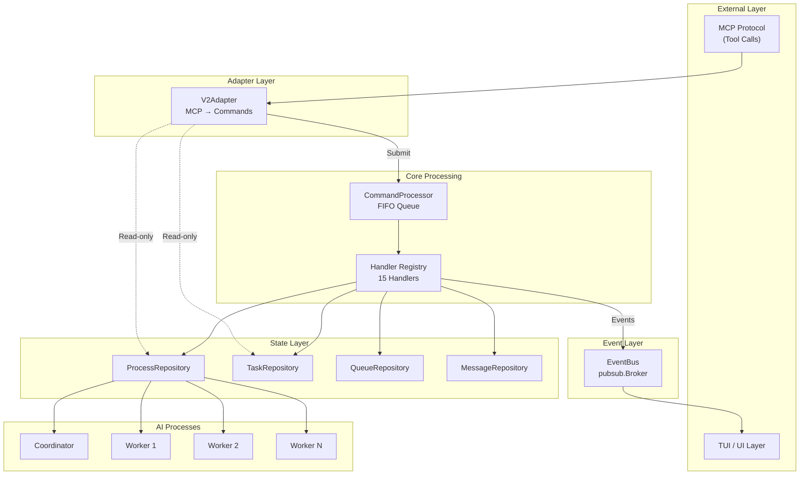
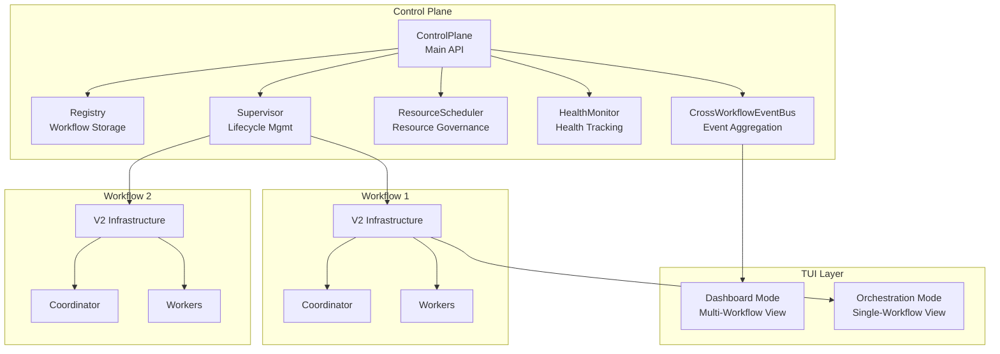

# V2 Orchestration Architecture

The v2 orchestration package provides a **command-driven, FIFO-processed** multi-agent coordination system for AI-assisted development workflows. It manages a coordinator process and multiple worker processes that collaborate on software development tasks.

## Architecture Overview



## Core Design Principles

### 1. Single-Threaded FIFO Processing
All state mutations flow through a single-threaded command processor, eliminating race conditions and ensuring deterministic execution order.

### 2. Command-Driven Architecture
Every action is represented as an explicit command with:
- Unique ID for tracing
- Command type for routing
- Validation before execution
- Source tracking (MCP, internal, callback, user)

### 3. Event Sourcing (Lite)
Handlers emit events that propagate to subscribers (TUI) via pub/sub, enabling real-time UI updates without tight coupling.

### 4. Read/Write Separation (CQRS)
- **Writes**: Go through CommandProcessor for ordering guarantees
- **Reads**: Bypass processor for low-latency direct repository access

## Package Structure

```
v2/
├── adapter/      # MCP protocol adapter (JSON → Commands)
├── command/      # Command types and base definitions
├── handler/      # 15 command handlers with business logic
├── integration/  # External system bridges (BD, message delivery)
├── process/      # AI process management and event loops
├── processor/    # FIFO command processor with middleware
├── prompt/       # System prompt generation
├── repository/   # In-memory state repositories
├── types/        # Shared types and error definitions
└── docs/         # This documentation
```

## Key Components

| Component | Purpose |
|-----------|---------|
| **V2Adapter** | Converts MCP tool calls to typed commands |
| **CommandProcessor** | FIFO queue with handler dispatch |
| **Handlers** | 15 handlers for lifecycle, messaging, tasks, state |
| **Repositories** | In-memory stores for processes, tasks, queues, messages |
| **EventBus** | Pub/sub broker for async TUI notification |
| **Process** | Unified struct managing AI event loops |
| **TurnCompletionEnforcer** | Ensures workers call required MCP tools each turn |

## Documentation

- [Commands and Handlers](./commands.md) - Complete command reference
- [Process Lifecycle](./process-lifecycle.md) - States, phases, and transitions
- [Message Flow](./message-flow.md) - End-to-end request processing

## Control Plane Integration

The v2 orchestration package integrates with the **Control Plane** (`internal/orchestration/controlplane/`) to support multi-workflow orchestration. The Control Plane provides:

### Architecture



### Component Responsibilities

| Component | Package | Purpose |
|-----------|---------|---------|
| **ControlPlane** | `controlplane/` | Unified API for multi-workflow lifecycle management |
| **Registry** | `controlplane/` | In-memory storage and querying of workflow instances |
| **Supervisor** | `controlplane/` | Starts/stops workflows, creates V2 infrastructure |
| **ResourceScheduler** | `controlplane/` | Manages resource limits (workflows, workers, AI calls, tokens) |
| **HealthMonitor** | `controlplane/` | Detects stuck workflows, triggers recovery actions |
| **CrossWorkflowEventBus** | `controlplane/` | Aggregates events from all workflows for unified subscription |
| **V2 Infrastructure** | `v2/` | Per-workflow command processor, handlers, and repositories |

### Workflow Lifecycle Flow

1. **Create**: `ControlPlane.Create(spec)` → Workflow in `Pending` state, stored in Registry
2. **Start**: `ControlPlane.Start(id)` → Supervisor creates V2 infrastructure, spawns coordinator
3. **Execute**: V2 command processor handles MCP tool calls, coordinator delegates to workers
4. **Monitor**: HealthMonitor tracks heartbeats, detects stuck workflows
5. **Stop**: `ControlPlane.Stop(id)` → Graceful shutdown with resource cleanup
6. **Shutdown**: `ControlPlane.Shutdown()` → Stops all workflows, releases all resources

## Quick Start

### Initialization Flow

```go
// 1. Create repositories
processRepo := repository.NewMemoryProcessRepository()
taskRepo := repository.NewMemoryTaskRepository()
queueRepo := repository.NewMemoryQueueRepository(1000)

// 2. Create event bus
eventBus := pubsub.NewBroker[any]()

// 3. Create processor with dependencies
proc := processor.NewCommandProcessor(
    processor.WithEventBus(eventBus),
    processor.WithTaskRepository(taskRepo),
    processor.WithQueueRepository(queueRepo),
)

// 4. Register handlers
proc.RegisterHandler(command.CmdSpawnProcess, handler.NewSpawnProcessHandler(...))
// ... register remaining handlers

// 5. Create adapter
adapter := adapter.NewV2Adapter(proc,
    adapter.WithProcessRepository(processRepo),
    adapter.WithTaskRepository(taskRepo),
)

// 6. Start processor
go proc.Run(ctx)
```

### Submitting Commands

```go
// Fire-and-forget
err := proc.Submit(command.NewSpawnProcessCommand(command.SourceUser, repository.RoleWorker))

// Synchronous with result
result, err := proc.SubmitAndWait(ctx, cmd)
```

### Subscribing to Events

```go
eventCh := eventBus.Subscribe(ctx)
for evt := range eventCh {
    if processEvt, ok := evt.Payload.(events.ProcessEvent); ok {
        // Handle process event
    }
}
```
